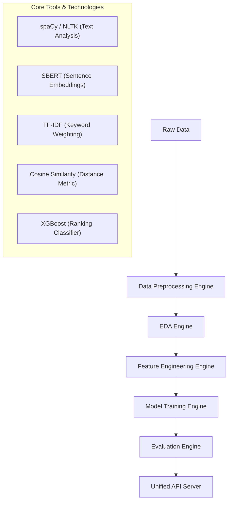

# 🔄 End-to-End System Workflow

This document illustrates the implementation and integration of the core AI tools within the **Automatic Resume Screening and AI Job Recommendation** system.

## 🏗 System Architecture Overview

The system follows a modular "Engine" architecture, providing a clear path from raw data to production-ready recommendations.

## 🛠 Tool Implementation & Integration Map

### 1. NLP & Semantic Cleanup (`spaCy`, `NLTK`)
- **Primary Logic**: [processor.py](file:///c:/Users/SAYYED%20HABEEB/Desktop/Bug%20busters-project/src/nlp/processor.py)
- **Role**: 
    - **spaCy**: Performs Named Entity Recognition (NER) to isolate person names, organizations, and locations.
    - **NLTK**: Handles lemmatization and stopword removal to ensure "python" and "Python developer" are processed consistently.

### 2. Dense Vector Embeddings (`SBERT`)
- **Primary Logic**: [engine.py (Feature Engineering)](file:///c:/Users/SAYYED%20HABEEB/Desktop/Bug%20busters-project/src/feature_engineering/engine.py)
- **Role**: Uses the `all-MiniLM-L6-v2` transformer model to create 384-dimensional semantic embeddings of resumes and job descriptions. This captures context that exact keyword matching misses.

### 3. Sparse Keyword Matching (`TF-IDF`)
- **Primary Logic**: [engine.py (Feature Engineering)](file:///c:/Users/SAYYED%20HABEEB/Desktop/Bug%20busters-project/src/feature_engineering/engine.py)
- **Role**: Generates frequency-based importance scores for technical skills. This ensures that rare, high-value skills (e.g., "TensorFlow") are weighted appropriately.

### 4. Similarity Computation (`Cosine Similarity`)
- **Primary Logic**: [services.py](file:///c:/Users/SAYYED%20HABEEB/Desktop/Bug%20busters-project/src/api/services.py)
- **Role**: Used as the primary scoring mechanism to calculate the "distance" between a resume embedding and a job embedding. This provides the mathematical foundation for ranking.

### 5. High-Precision Re-Ranking (`XGBoost`)
- **Primary Logic**: [engine.py (Modeling)](file:///c:/Users/SAYYED%20HABEEB/Desktop/Bug%20busters-project/src/modeling/engine.py)
- **Role**: A gradient-boosted decision tree classifier that takes raw similarity scores, skill match ratios, and experience gaps as inputs to produce a final "Match Probability."

## 🚀 Execution & Orchestration

The entire workflow is operationalized through [main.py](file:///c:/Users/SAYYED%20HABEEB/Desktop/Bug%20busters-project/main.py), which coordinates the transition between stages:

1.  **Preparation**: `EDAEngine` audits data quality.
2.  **Featurization**: `FeatureEngine` builds the semantic matrix using SBERT and TF-IDF.
3.  **Optimization**: `ModelTrainingEngine` tunes the XGBoost model and generates SHAP explainability plots.
4.  **Verification**: `EvaluationEngine` benchmarks NDCG and Precision metrics.
5.  **Deployment**: `api/server.py` hosts the endpoint for real-time inference.
