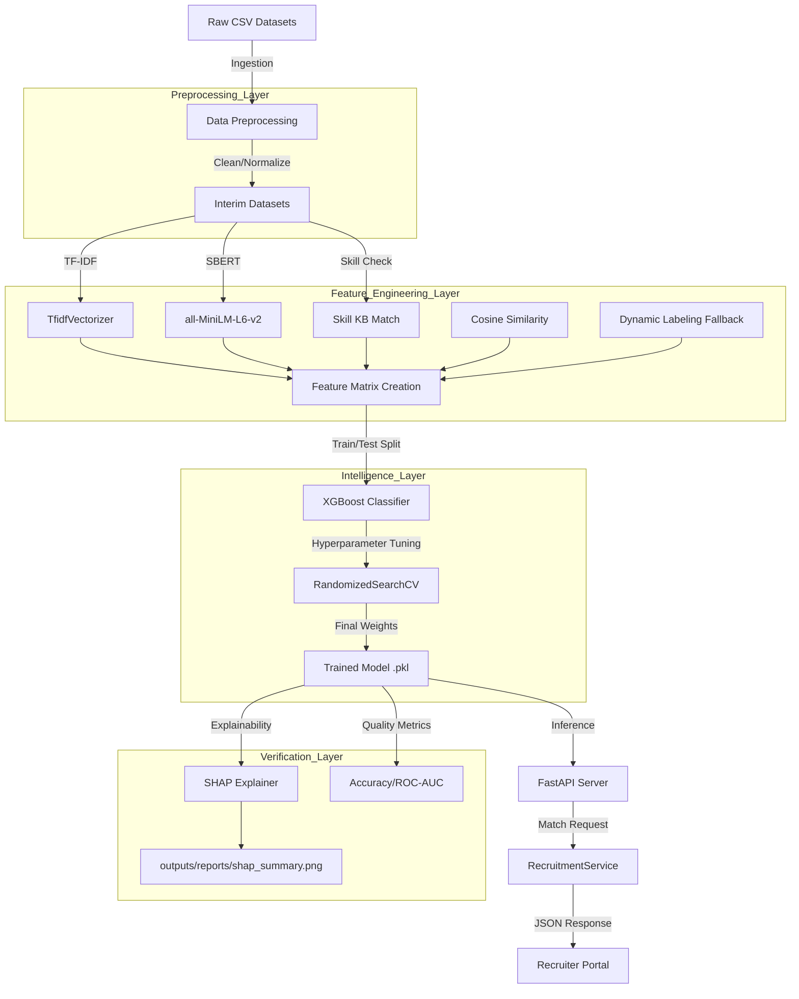

# Model Pipeline Guide: Bug-Busters AI

This document provides a comprehensive overview of the AI pipeline for resume-job matching, from data ingestion to model inference.

## 1. Pipeline Overview

The pipeline consists of four main stages, orchestrated by `main.py`.

### A. Exploratory Data Analysis (EDA)
- **Engine**: `src/data_processing/eda_engine.py`
- **Goal**: Understand data distribution, identify missing values, and analyze text statistics.
- **Files Used**: 
  - `data/interim/resumes_clean.csv`
  - `data/interim/jobs_clean.csv`
- **Command**: `python main.py --eda`
- **Example Output**: `outputs/reports/eda/eda_summary.json` (Text length distributions, word clouds).

### B. Feature Engineering
- **Engine**: `src/feature_engineering/engine.py`
- **Goal**: Convert text to numerical signals for machine learning.
- **Full Toolset**:
  - **TF-IDF**: `TfidfVectorizer` (ngram_range=(1,2)) for statistical keyword weight.
  - **Semantic Embeddings**: `SBERT` (`all-MiniLM-L6-v2`) for context-aware similarity.
  - **Similarity Metric**: `Cosine Similarity` for both TF-IDF and SBERT vectors.
  - **Skill Extraction**: Professional skill matching against a curated knowledge base.
- **Output Artifacts**: 
  - `data/processed/features/feature_matrix.csv`
  - `data/processed/features/tfidf_vectorizer.pkl`

### C. Model Training
- **Engine**: `src/modeling/engine.py`
- **Goal**: Train an XGBoost Classifier with Stratified K-Fold cross-validation.
- **Handling Imbalance**: Automatically calculates `scale_pos_weight` and uses dynamic labeling to handle statistical outliers.
- **Tuning**: `RandomizedSearchCV` for optimal hyperparameters.
- **Explainability**: `SHAP` values for feature importance and transparency.
- **Command**: `python main.py --train`
- **Output Artifacts**:
  - `outputs/models/trained_model.pkl`
  - `outputs/models/model_metadata.json`

### D. Evaluation
- **Engine**: `src/evaluation/engine.py`
- **Goal**: Calculate accuracy, precision, recall, and ROC-AUC.
- **Command**: `python main.py --evaluate`

---

## 2. End-to-End Workflow

### Step-by-Step Workflow Narrative

1.  **Data Ingestion**: Raw resume and job datasets are loaded from `data/raw/`.
2.  **Preprocessing**: The `DataProcessingEngine` uses **Regex** and **Pandas** to clean text, remove junk characters, and standardize columns into `data/interim/`.
3.  **Exploration**: `EDAEngine` analyzes the interim data to ensure quality and distribution balance.
4.  **Vectorization**:
    *   **TF-IDF** calculates the statistical importance of words.
    *   **SBERT** encodes the "meaning" of sentences into a 384-dimensional latent space.
5.  **Feature Construction**: A high-dimensional **Feature Matrix** is built, combining similarities, skill overlap ratios, and quality scores.
6.  **Labeling**: If manual labels are missing, the system uses **Dynamic Labeling** (similarity thresholding) to create synthetic positive/negative samples for training.
7.  **Training**: **XGBoost** is trained using **Stratified K-Fold**. Hyperparameters are tuned via **RandomizedSearchCV** to find the perfect balance between precision and recall.
8.  **Explainability**: The **SHAP** library generates feature importance plots, showing which skills or similarity scores most influenced the model's decision.
9.  **Deployment**: The trained model and TF-IDF artifacts are serialized. The **FastAPI** server loads these to provide real-time recommendations to the **Recruiter Portal**.

---

## 3. Command Reference

| Action | Command |
|--------|---------|
| **Run Full Pipeline** | `python main.py --all` |
| **Start API Server** | `python main.py --api` |
| **Start Frontend** | `npm run dev` (in `frontend/`) |
| **Health Check** | `curl http://localhost:8000/health` |
